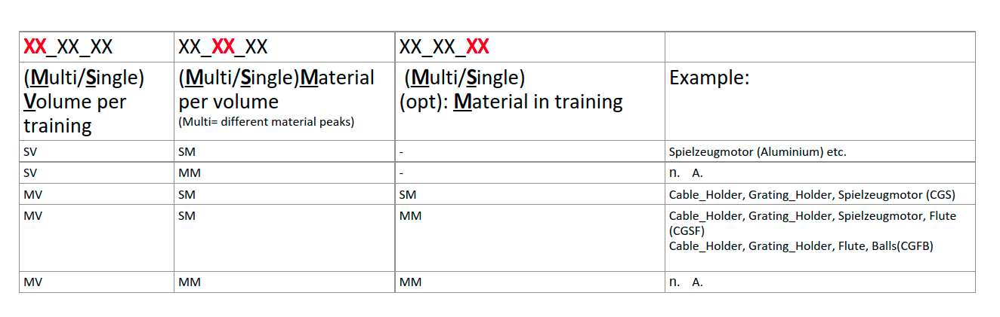

# DL_BeamHardening

## Use-cases naming convention


## Dataset preparation scripts

### tiff_to_hdf5
Requirements, install:  
```
<python-interpreter> -m pip install pyqt5 numpy 
```
How to run: 

```
<python-interpreter> tiff_to_hdf5.py -f <path-tiff-file-folder> -o <absolute-path-of-output>
```