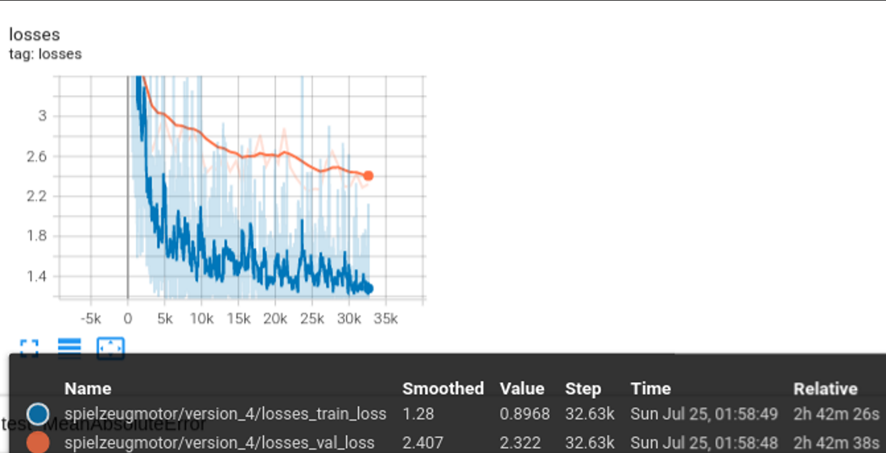

# CT Scan Beam Hardening Artifact Reduction using Convolutional Neural Networks

## Introduction: The Problem of Beam Hardening Artifacts

Computed Tomography (CT) scans are invaluable tools in various fields, from medical diagnostics to industrial inspection. However, a common challenge in CT imaging is the presence of "beam hardening" artifacts. These artifacts arise because X-ray beams are polychromatic (composed of photons with a range of energies), and as they pass through an object, lower-energy photons are preferentially absorbed. This leads to a "hardening" of the beam, meaning its average energy increases.

The consequence of beam hardening is a distortion in the reconstructed CT image, manifesting as:
- **Cupping artifacts:** A darker appearance in the center of homogeneous objects.
- **Streaking artifacts:** Dark or bright streaks appearing between dense objects or through highly attenuating structures.
- **Shading artifacts:** Non-uniform intensity across the image.

These artifacts can obscure details, reduce image quality, and lead to inaccurate quantitative measurements, thereby limiting the diagnostic and analytical capabilities of CT imaging.

## Solution: CNN-based Artifact Reduction

This project addresses the challenge of beam hardening artifact reduction by employing Convolutional Neural Networks (CNNs). Our approach leverages the power of deep learning to learn complex mappings from artifact-ridden CT images to corrected, artifact-free images.

The core of our solution involves training CNNs to identify and mitigate these distortions. The models are designed to effectively learn the patterns associated with beam hardening and apply corrections, resulting in significantly improved image quality.

## Data Generation and Training

A crucial aspect of this project was the generation of artificial training data. Given the difficulty and cost of acquiring large volumes of real-world, perfectly artifact-free CT data, we utilized specialized artist software to simulate CT scans and generate synthetic datasets. This allowed for precise control over various parameters and the creation of diverse scenarios for robust model training.

An example of the artist software GUI used for data generation can be seen below:

Further insights into the simulated CT scans, including attenuation plots and spatial setups, are provided in the following figures:

Due to the large volumes of data generated, the HDF (Hierarchical Data Format) format was chosen for efficient storage and handling. The training process involved processing this data in slices, optimizing memory usage and computational efficiency.

The CNNs were trained on a powerful hardware setup consisting of **4x Nvidia GTX 1080 GPUs**. The deep learning framework used for all training procedures was **PyTorch Lightning**, which provided a structured and efficient way to manage the training pipelines.

## Naming Conventions

To ensure clarity and consistency throughout the project, the following naming conventions were adopted, particularly for distinguishing between different training scenarios:

- **SV: Single-Volume** for training. This refers to models trained on individual CT volumes.
- **MV: Multi-Volume** for training. This refers to models trained across multiple CT volumes.
- **SM: Single Material**. This indicates that the training data contained objects composed of a single material.
- **MM: Multi-Material**. This indicates that the training data contained objects composed of multiple materials within one volume.

The last `MM/SM` in a naming convention specifically refers to whether single or multi-material data was used in the training process.

For a visual explanation of these naming conventions, refer to:

## Results and Validation

Various validation images and plots demonstrate the effectiveness of our CNN models in reducing beam hardening artifacts.

**Multi-Volume, Single/Multi-Material Prediction Validation:**

**Multi-Volume, Single/Multi-Material Validation Peak Signal-to-Noise Ratio:**

**Single-Volume, Single-Material Loss for "Spielzeugmotor":**

**Single-Volume, Single-Material Prediction Test Image:**

**Single-Volume, Single-Material Prediction Validation Image:**

## Integration

Following successful training and validation, the developed CNN model was integrated into a **C++ image processing software**. This integration allows for the practical application of the trained model in real-world CT image processing workflows, enabling automated and efficient reduction of beam hardening artifacts.